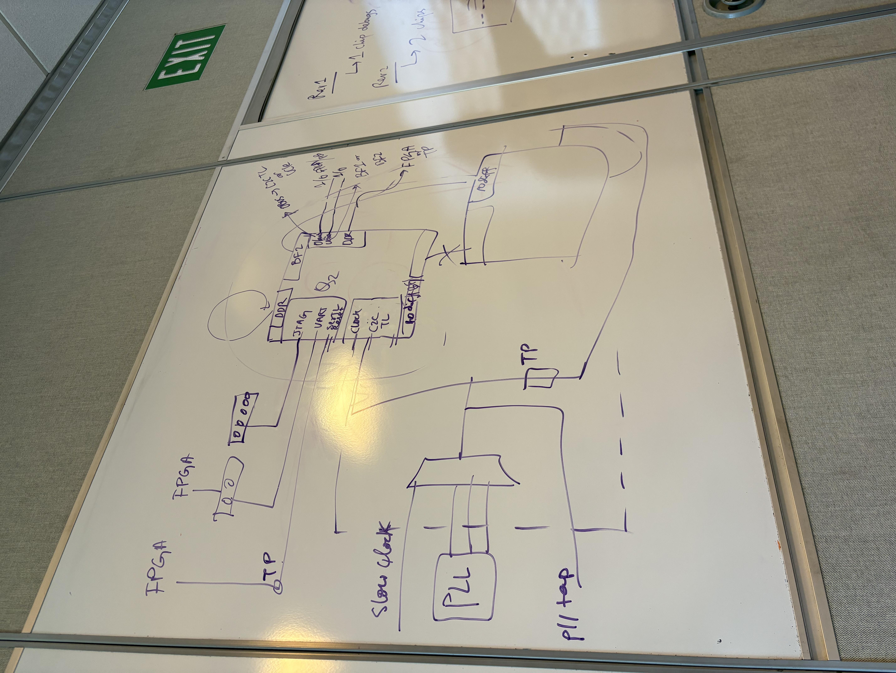
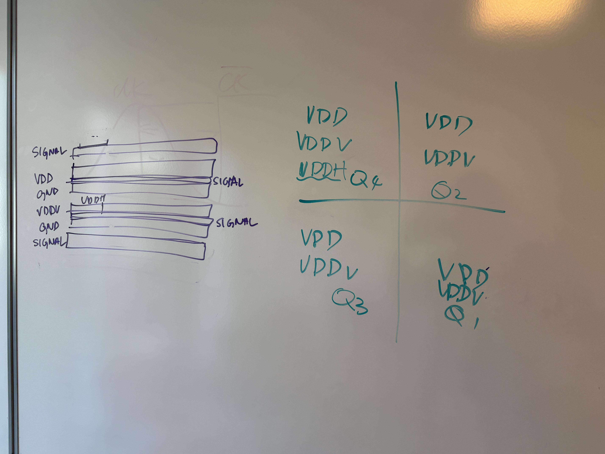

# Cygnus bringup

This project serves as PCB bringup for the Cygnus chip taped-out in 2024 Q2. The Cygnus chip is a pair of 4x4 $mm^2$ chiplets on the same package on a 16nm process. The chip is designed to be a low-power, high-performance chip for DSP computing applications, and to showcase scalability of the chiplet architecture for future AI applications.

## Timeline
### Oct 25, PCB kickoff

## Test plan

## PCB Considerations
1. No high speed signals on Q2 chip
2. SerialTL interface
3. Testpoints
4. DDR considerations
5. Power Supply # Cygnus-Bringup

## PCB

Stackup: JLC10121H-2116

[Altium 365](https://ucb-bar.365.altium.com/designs/48DF959B-C662-42B1-99D3-1AA11DF22FD2#design)

## Bringup FPGA

[Digilent Nexys Video](https://digilent.com/shop/nexys-video-artix-7-fpga-trainer-board-for-multimedia-applications/)

- $550
- Artix 7
- USB-UART / Ethernet / FT2232 (FTDI USB-FIFO chip, kind of an old part with iffy drivers)
- 512 MiB DDR3
- FMC-LPC (ASP-134603-01), 34x2 pins, Vadj set to 1.2V by default, easy
- Used by Maveric Bringup

## Schematic

### Power and Clock

#### Digital Supply (VDD_D)

0.85 V, generated by bench power supply through banana connector

#### IO (VDD_IO)

1.2 V, generated by bench power supply through banana connector

#### DDR Power (VDD_DDR)

vddh_q4 is special, and is allocated for DDR power.

#### Ground

single ground shorted together

#### Core clock (CLK, clock 1_24)

100 MHz nominal slow clock, driven by external clock generator.

1.2 Vpp

50 Ohm impedance

#### PLL refclk (PLL_CLK, refclk 1_28)**

100 MHz nominal input, 1.2 Vpp

### IO Signals

#### Chip Reset

Chip reset is active high (TODO: confirm this)

Reset connect to button, no need for header pin since we haven't use this feature in previous bringups.

#### JTAG

Low priority low speed signal, route to pin header

#### 

### Test Circuit

Decide to allocate a small portion of PCB area to test circuit. This is used to verify the level shifter and other IC selections for future board designs.

Except for power domain, this circuit is isolated to the core circuitry.

## FMC Pinout

| Signal                    | FMC Net Name  | FMC Pin | FPGA Pin (Nexys Video)  | Notes |
| ---                       | ---           | ---     | ---                     | ---   |
| serial_tl_clock           | LA_00_P_CC    | G6      |                      |       |
| serial_tl_in_valid        | LA_03_P       | G9      |                      |       |
| serial_tl_in_ready        | LA_03_N       | G10     |                      |       |
| serial_tl_in_bits\[0\]    | LA_08_P       | G12     |                      |       |
| serial_tl_out_valid       | LA_02_P       | H7      |                      |       |
| serial_tl_out_ready       | LA_02_N       | H8      |                      |       |
| serial_tl_out_bits\[0\]   | LA_04_P       | H10     |                      |       |
| reset                     |        |      |                      |       |
| uart_rx                   |        |       |                      | via selection jumper |
| uart_tx                   |        |       |                      | via selection jumper |

## PCB Layout

8 layer PCBs

| Index | Layer Name | Material | Thickness | Purpose    |
| ----- | ---------- | -------- | --------- | ---------- |
| 1     | Top        |          |           | High Speed Signals, DDR + Clock + SerialTL, U1     |
| 2     | In1        |          |           | GND        |
| 3     | In2        |          |           | Low Speed Signals, U1 + U2     |
| 4     | In3        |          |           | GND      |
| 5     | In4        |          |           | VDD_IO |
| 6     | In5        |          |           | VDD_pre + VDDQ      |
| 7     | In6        |          |           | Ground |
| 8     | In7        |          |           | VDD_core for U1 + U2|
| 9     | In8        |          |           | GND |
| 10     | Bottom |          |           | High Speed Signals, DDR + Clock + SerialTL, U2     |

Layout will be done in millimeters (mm)

